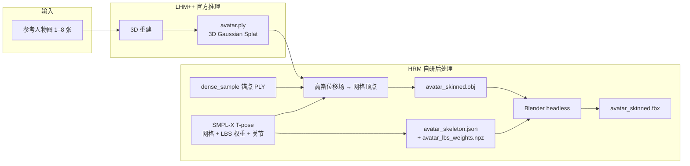
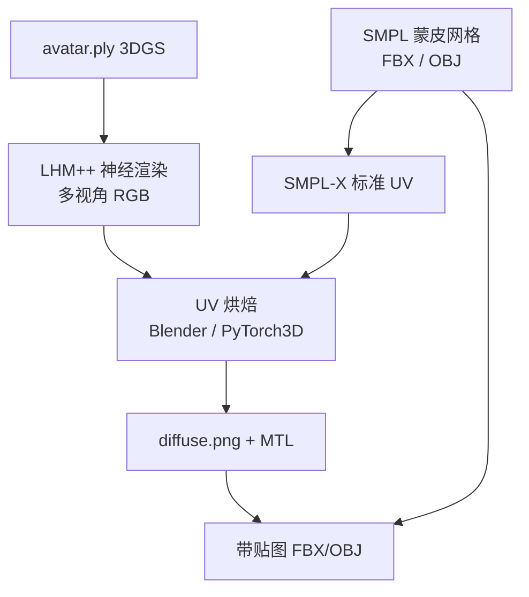

# HRM — LHM++ 人体 3D 重建与动作驱动

基于 [LHM++](https://lingtengqiu.github.io/LHM++/) 的全栈工具：用一组人物图片生成可动画 3D 模型，再通过动作视频或摄像头视频流驱动角色。

- **后端**：FastAPI（`api/`），封装 LHM++ GPU 推理
- **前端**：Next.js（`web/`），单页工作流 UI

---

## 目录

- [架构](#架构)
- [功能一览](#功能一览)
- [环境要求](#环境要求)
- [安装与启动](#安装与启动)
  - [1. 安装 LHM-plusplus](#1-安装-lhm-plusplus)
  - [2. 启动 API 后端](#2-启动-api-后端)
  - [3. 启动 Web 前端](#3-启动-web-前端)
- [Web 界面使用](#web-界面使用)
- [API 使用说明](#api-使用说明)
  - [健康检查](#健康检查)
  - [创建 Avatar（3D 重建）](#创建-avatar3d-重建)
  - [下载模型文件](#下载模型文件)
  - [动作视频驱动](#动作视频驱动)
  - [摄像头流驱动（WebSocket）](#摄像头流驱动websocket)
  - [任务查询](#任务查询)
- [输出文件说明](#输出文件说明)
- [3DGS 查看器](#3dgs-查看器)
- [蒙皮网格导出与实现原理](#蒙皮网格导出与实现原理)
- [Mock 模式（无 GPU 联调）](#mock-模式无-gpu-联调)
- [配置项参考](#配置项参考)
- [不修改 LHM-plusplus 仓库](#不修改-lhm-plusplus-仓库)
- [项目结构](#项目结构)
- [常见问题](#常见问题)
- [参考链接](#参考链接)
- [License](#license)

---

## 架构

```
┌─────────────┐     HTTP/WS      ┌──────────────────┐     Python API     ┌──────────────┐
│  Next.js    │ ◄──────────────► │  FastAPI (api/)  │ ◄────────────────► │  LHM-plusplus │
│  Web 前端   │                  │  任务队列/文件    │                    │  GPU 推理     │
└─────────────┘                  └──────────────────┘                    └──────────────┘
```

数据默认保存在 `api/data/` 下：

```
api/data/
├── avatars/{avatar_id}/   # 每个 Avatar 的输入图、输出模型、动画
├── jobs/                  # 异步任务状态
└── motion_cache/          # 动作提取缓存
```

---

## 功能一览


| 功能        | API                                                 | 说明                                     |
| --------- | --------------------------------------------------- | -------------------------------------- |
| 健康检查      | `GET /api/v1/health`                                | 服务状态、LHM++ 可用性、是否 Mock 模式              |
| 多图 3D 重建  | `POST /api/v1/avatars`                              | 上传 1–8 张全身人物图，导出 Gaussian Splat `.ply` |
| 蒙皮网格导出    | `POST /api/v1/avatars` + `export_skinned_mesh=true` | 同时导出 SMPL-X 蒙皮 **FBX** + 骨骼 JSON（需 Blender） |
| 查询 Avatar | `GET /api/v1/avatars/{id}`                          | 获取元数据与生成结果路径                           |
| 下载高斯模型    | `GET /api/v1/avatars/{id}/model`                    | 下载 `.ply`                              |
| 下载蒙皮 FBX  | `GET /api/v1/avatars/{id}/mesh?format=fbx`          | 带 Armature 的蒙皮 FBX（Unity/Maya）          |
| 下载骨骼      | `GET /api/v1/avatars/{id}/skeleton`                 | SMPL-X 55 关节 + LBS 权重 JSON             |
| 预览图       | `GET /api/v1/avatars/{id}/preview`                  | 参考图预览                                  |
| 动作视频驱动    | `POST /api/v1/avatars/{id}/animate`                 | 上传动作视频，渲染动画 MP4                        |
| 摄像头流驱动    | `WS /api/v1/avatars/{id}/motion-stream`             | 实时发送 JPEG 帧，批量推理动画                     |
| 任务查询      | `GET /api/v1/jobs/{id}`                             | 轮询重建/动画进度                              |
| 下载动画视频    | `GET /api/v1/jobs/{id}/video`                       | 下载渲染结果 MP4                             |


---

## 环境要求


| 组件           | 要求                                         |
| ------------ | ------------------------------------------ |
| GPU          | 推荐 NVIDIA ≥8GB 显存（LHMPP-700M-PixelShuffle） |
| Python       | 3.10+（与 LHM++ 官方一致）                        |
| Node.js      | 18+                                        |
| LHM-plusplus | 需单独克隆安装，见下方                                |
| CUDA         | 12.1（与 LHM++ 官方推荐一致）                       |


---

## 安装与启动

### 1. 安装 LHM-plusplus

## WSL (Ubuntu) 安装 CUDA12.1 Toolkit（官方源）

### 1) 添加 WSL 专属 CUDA 源

bash

运行

```
# 固定源优先级
wget https://developer.download.nvidia.com/compute/cuda/repos/wsl-ubuntu/x86_64/cuda-wsl-ubuntu.pin
sudo mv cuda-wsl-ubuntu.pin /etc/apt/preferences.d/cuda-repository-pin-600

# 导入密钥+添加软件源
wget https://developer.download.nvidia.com/compute/cuda/repos/wsl-ubuntu/x86_64/cuda-keyring_1.1-1_all.deb
sudo dpkg -i cuda-keyring_1.1-1_all.deb
sudo apt update
```

### 2) 只安装 CUDA12.1 工具包（不带驱动）

bash

运行

```
sudo apt install -y cuda-toolkit-12-1
```

安装路径默认：`/usr/local/cuda-12.1`，自动软链接 `/usr/local/cuda`。

在 GPU 服务器上克隆并安装 [LHM-plusplus](https://github.com/aigc3d/LHM-plusplus)：

```bash
git clone https://github.com/aigc3d/LHM-plusplus
cd LHM-plusplus

# 需 Python 3.10（LHM++ 官方要求）；请用 python -m pip，避免 pip 指向其他 Python 版本
python -m pip install --upgrade pip setuptools wheel

apt update && apt install -y libglx-mesa0 libgl1 libglib2.0-0

# 安装 PyTorch 2.3 + CUDA 12.1（见官方 README）
python -m pip install torch==2.3.0 torchvision==0.18.0 torchaudio==2.3.0 --index-url https://download.pytorch.org/whl/cu121
python -m pip install -U xformers==0.0.26.post1 --index-url https://download.pytorch.org/whl/cu121

# chumpy 需先单独安装（直接 pip install -r requirements.txt 可能报 No module named 'pip'）
python -m pip install --no-build-isolation chumpy

python -m pip install -r requirements.txt
python -m pip install rembg[cpu]

# install pointops
cd ./lib/pointops/ && python setup.py install && cd ../../

pip install spconv-cu121
# pip install torch_scatter, see [wheel](https://data.pyg.org/whl/) for your CUDA version
# For example (PyTorch 2.3 + CUDA 12.1 + Python 3.10):
pip install torch_scatter -f https://data.pyg.org/whl/torch-2.3.0+cu121.html

# 安装 pointops、spconv、gsplat 等（见官方 INSTALL.md / INSTALL_CN.md）
# PyTorch3D（Linux 预编译 wheel；Windows 见下方说明）
python -m pip install --no-index --no-cache-dir pytorch3d -f https://dl.fbaipublicfiles.com/pytorch3d/packaging/wheels/py310_cu121_pyt230/download.html
#上面的如果报错，就执行下面两行
#pip install git+https://ghproxy.net/https://github.com/facebookresearch/fvcore.git -i https://pypi.tuna.tsinghua.edu.cn/simple
#pip install git+https://ghproxy.net/https://github.com/facebookresearch/iopath.git -i https://pypi.tuna.tsinghua.edu.cn/simple

# install simple-knn
pip install git+https://github.com/camenduru/simple-knn/ --no-build-isolation

# install gsplat
# pip install gsplat from pre-compiled [wheel](https://docs.gsplat.studio/whl/gsplat/)
# For example (PyTorch 2.3 + CUDA 12.1 + Python 3.10):
# gsplat-1.4.0+pt23cu121-cp310-cp310-linux_x86_64.whl
pip install gsplat==1.4.0+pt23cu121 --index-url https://docs.gsplat.studio/whl

# 下载依赖（download_all.py 需要）
# 如果这里卡了，可以加临时镜像
# export HF_ENDPOINT=https://hf-mirror.com
python -m pip install "huggingface_hub==0.23.2" modelscope

# 一键下载模型与动作数据（须在 LHM-plusplus 根目录执行）
python scripts/download_all.py

# 国内安装可以添加国内源
-i https://pypi.tuna.tsinghua.edu.cn/simple --trusted-host pypi.tuna.tsinghua.edu.cn
```

**动作视频提取（可选）**：若需从用户上传视频提取 SMPL-X 动作，需确保存在 `engine/pose_estimation/video2motion.py`（可从 [LHM 仓库](https://github.com/aigc3d/LHM) 复制到 LHM++ 同路径）。

**官方 Gradio 演示**（验证 LHM++ 安装）：

```bash
python app.py --model_name LHMPP-700M-PixelShuffle
```

#### PyTorch3D 安装说明（`No module named 'pytorch3d'`）

LHM++ 的姿态估计（`PoseEstimator`）依赖 **PyTorch3D**，3D 重建与 `to_gs_ply.py` 都会用到。


| 平台          | 安装方式                                           |
| ----------- | ---------------------------------------------- |
| **Linux**   | 直接装官方 wheel（见上方命令）                             |
| **Windows** | **无官方预编译包**（Facebook 仅提供 `linux_x86_64` wheel） |


**Windows 可选方案：**

1. **推荐：WSL2 + Ubuntu** 或 **Linux GPU 服务器** 安装 LHM++，HRM API 的 `LHM_ROOT` 指向该环境（或远程调用）。
2. **本地联调**：`api/.env` 设 `MOCK_MODE=true`，Windows 上跑 HRM 前端 + API，不依赖 PyTorch3D。
3. **Windows 源码编译**（耗时、需工具链）：
  - 安装 [Visual Studio 2019/2022](https://visualstudio.microsoft.com/)（勾选「使用 C++ 的桌面开发」）
  - 安装 [CUDA Toolkit 12.1](https://developer.nvidia.com/cuda-12-1-0-download-archive) 并设置 `CUDA_HOME`
  - 在 **「x64 Native Tools Command Prompt for VS」** 中执行：

```powershell
python -m pip install fvcore iopath
git clone https://github.com/facebookresearch/pytorch3d.git
cd pytorch3d
git checkout v0.7.6
set DISTUTILS_USE_SDK=1
set PYTORCH3D_NO_NINJA=1
python setup.py install
```

编译可能需 30–60 分钟；若报 CUDA/CUB 相关错误，见 [pytorch3d Windows 安装讨论](https://github.com/facebookresearch/pytorch3d/issues/1567)。

### 2. 启动 API 后端

```bash
cd api
pip install -r requirements.txt
cp .env.example .env
```

编辑 `api/.env`：

```env
# LHM-plusplus 仓库绝对路径（真实推理必填）
LHM_ROOT=D:/path/to/LHM-plusplus

# 模型名称（与 LHM++ 一致）
MODEL_NAME=LHMPP-700M-PixelShuffle

# 可选：本地权重路径，不填则自动从 HuggingFace/ModelScope 下载
MODEL_PATH=

# true = 无 GPU 联调模式；false = 真实推理
MOCK_MODE=false

# 前端地址（CORS）
CORS_ORIGINS=http://localhost:3000

# API 监听
API_PORT=8000
```

启动：

```bash
# 方式一
uvicorn main:app --host 0.0.0.0 --port 8000 --reload

# 方式二
python run.py
```

- API 根路径：[http://localhost:8000](http://localhost:8000)
- 交互文档：[http://localhost:8000/docs](http://localhost:8000/docs)
- OpenAPI JSON：[http://localhost:8000/openapi.json](http://localhost:8000/openapi.json)

### 3. 启动 Web 前端

```bash
cd web
npm install
cp .env.local.example .env.local
```

编辑 `web/.env.local`：

```env
NEXT_PUBLIC_API_URL=http://localhost:8000
NEXT_PUBLIC_WS_URL=ws://localhost:8000
```

启动：

```bash
npm run dev      # 开发：http://localhost:3000
npm run build    # 生产构建
npm run start    # 生产运行
```

前端通过 `next.config.js` 将 `/api/*` 代理到 `NEXT_PUBLIC_API_URL`，也可直接请求后端地址。

---

## Web 界面使用

打开 [http://localhost:3000](http://localhost:3000) ，按以下步骤操作：

### 步骤 1：上传参考图片

- 拖拽或选择 **1–8 张**全身人物照片（不同角度更佳，无需相机位姿）
- 调整 **参考视角数量**（1–8，默认 8）
- 可选：勾选 **「同时导出 SMPL-X 蒙皮网格」**（见 [蒙皮网格导出与实现原理](#蒙皮网格导出与实现原理)）
- 点击 **「开始 3D 重建」**

### 步骤 2：等待重建完成

- 页面显示任务进度条与状态（`pending` → `running` → `completed`）
- 完成后可预览参考图，并下载：
  - **Gaussian Splat PLY**（高斯点云模型）
  - **蒙皮 FBX**（若已开启导出且服务器已装 Blender）
  - **SMPL-X 骨骼 JSON**（若已开启导出开关）

### 步骤 3：动作驱动

重建完成后，任选一种方式：

**方式 A：上传动作视频**

1. 选择一段人体动作视频（最多 1000 帧）
2. 调整渲染帧数（30–300，默认 120）
3. 点击 **「生成动画」**
4. 完成后页面播放 MP4 结果

**方式 B：摄像头实时捕获**

1. 点击 **「开启摄像头」**
2. 对着摄像头做动作（至少采集 **30 帧**）
3. 点击 **「提交动作」** 开始推理
4. 等待完成后播放动画视频

---

## API 使用说明

所有接口前缀为 `/api/v1`。异步任务通过 `job_id` 轮询进度。

### 健康检查

```bash
curl http://localhost:8000/api/v1/health
```

响应示例：

```json
{
  "status": "ok",
  "lhmpp_available": true,
  "mock_mode": false
}
```

### 创建 Avatar（3D 重建）

```bash
curl -X POST http://localhost:8000/api/v1/avatars \
  -F "images=@photo1.png" \
  -F "images=@photo2.png" \
  -F "ref_view=8" \
  -F "export_skinned_mesh=false"
```


| 参数                    | 类型     | 默认    | 说明                 |
| --------------------- | ------ | ----- | ------------------ |
| `images`              | file[] | 必填    | 1–8 张人物图片          |
| `ref_view`            | int    | 8     | 实际用于推理的参考视角数       |
| `export_skinned_mesh` | bool   | false | 是否同时导出 SMPL-X 蒙皮网格 |


响应：

```json
{
  "avatar_id": "uuid",
  "job_id": "uuid",
  "status": "pending"
}
```

轮询任务：

```bash
curl http://localhost:8000/api/v1/jobs/{job_id}
```

任务 `status` 为 `completed` 时，`result` 中包含 `ply_path`、`preview_path` 等路径；若开启蒙皮导出，还包含 `mesh_fbx_path`、`skeleton_json_path` 等。

### 下载模型文件

```bash
# 高斯 PLY
curl -O http://localhost:8000/api/v1/avatars/{avatar_id}/model

# 蒙皮 FBX（Unity / Maya）
curl -O "http://localhost:8000/api/v1/avatars/{avatar_id}/mesh?format=fbx"

# SMPL-X 骨骼 JSON（权重与关节元数据）
curl -O http://localhost:8000/api/v1/avatars/{avatar_id}/skeleton

# 预览图
curl -O http://localhost:8000/api/v1/avatars/{avatar_id}/preview
```

### 动作视频驱动

```bash
curl -X POST http://localhost:8000/api/v1/avatars/{avatar_id}/animate \
  -F "motion_video=@dance.mp4" \
  -F "motion_frames=120" \
  -F "render_backend=neural"
```


| 参数               | 类型     | 默认     | 说明                                |
| ---------------- | ------ | ------ | --------------------------------- |
| `motion_video`   | file   | 必填     | 动作参考视频                            |
| `motion_frames`  | int    | 120    | 渲染帧数（30–1000）                     |
| `render_backend` | string | neural | `neural`（神经渲染）或 `gs`（纯高斯光栅，需模型支持） |


完成后下载视频：

```bash
curl -O http://localhost:8000/api/v1/jobs/{job_id}/video
```

### 摄像头流驱动（WebSocket）

连接：

```
ws://localhost:8000/api/v1/avatars/{avatar_id}/motion-stream
```

**客户端 → 服务端消息**（JSON 文本）：


| type    | 字段       | 说明                                             |
| ------- | -------- | ---------------------------------------------- |
| `frame` | `data`   | base64 JPEG 帧（可带 `data:image/jpeg;base64,` 前缀） |
| `flush` | —        | 提交缓冲帧，开始推理（至少 30 帧）                            |
| `poll`  | `job_id` | 查询推理任务状态                                       |
| `close` | —        | 关闭连接                                           |


**服务端 → 客户端消息**：


| type          | 说明                           |
| ------------- | ---------------------------- |
| `ready`       | 连接就绪，可开始发帧                   |
| `buffer`      | 当前缓冲帧数 `{ count, required }` |
| `processing`  | 开始处理 `{ job_id, frames }`    |
| `job_started` | 任务已创建 `{ job_id }`           |
| `job_status`  | 任务状态；完成时含 `video_url`        |
| `error`       | 错误信息                         |


示例（JavaScript）：

```javascript
const ws = new WebSocket(`ws://localhost:8000/api/v1/avatars/${avatarId}/motion-stream`);

ws.onmessage = (e) => {
  const msg = JSON.parse(e.data);
  if (msg.type === "job_status" && msg.status === "completed") {
    window.open(`http://localhost:8000${msg.video_url}`);
  }
};

// 发送帧
ws.send(JSON.stringify({ type: "frame", data: canvas.toDataURL("image/jpeg", 0.7) }));

// 提交推理
ws.send(JSON.stringify({ type: "flush" }));

// 轮询
ws.send(JSON.stringify({ type: "poll", job_id: "..." }));
```

### 任务查询

```bash
curl http://localhost:8000/api/v1/jobs/{job_id}
```

响应字段：


| 字段         | 说明                                             |
| ---------- | ---------------------------------------------- |
| `status`   | `pending` / `running` / `completed` / `failed` |
| `progress` | 0–100                                          |
| `message`  | 当前阶段描述                                         |
| `result`   | 完成时的输出路径等信息                                    |
| `error`    | 失败时的错误信息                                       |


---

## 输出文件说明

每个 Avatar 在 `api/data/avatars/{avatar_id}/` 下生成：

```
{avatar_id}/
├── inputs/              # 上传的原始图片
│   └── input_000.png
├── output/              # 重建结果
│   ├── ref_images/      # 预处理后的参考图
│   ├── avatar.ply       # 3D Gaussian Splat（LHM++ 官方 to_gs_ply 导出）
│   ├── betas.json       # SMPL-X 体型参数（真实推理时）
│   ├── avatar.ply                  # 3D Gaussian Splat
│   ├── avatar_skinned.obj          # 蒙皮网格中间产物（Blender 导入用，内部）
│   ├── avatar_skinned.fbx          # 蒙皮 FBX（可选，Unity/Maya）
│   ├── avatar_skeleton.json        # SMPL-X 骨骼与权重（可选）
│   └── avatar_lbs_weights.npz      # 完整 LBS 权重矩阵（可选）
├── motion/              # 上传的动作视频
└── animations/{job_id}/ # 动画渲染结果
    └── animation.mp4
```

---

## 3DGS 查看器

HRM 自带浏览器端 3DGS 预览工具（`3dgs/`），用于查看 `avatar.ply`（MeshLab 等普通软件会显示为黑点）。

```bash
cd 3dgs
npm install
npm run dev
```

打开 **http://localhost:5174**，拖放 PLY，或使用 HRM API 链接：

```
http://localhost:5174/?ply=http://localhost:8000/api/v1/avatars/{avatar_id}/model
```

跨域加载时在 `api/.env` 增加：`CORS_ORIGINS=http://localhost:3000,http://localhost:5174`

详见 [`3dgs/README.md`](3dgs/README.md)。

---

## 蒙皮网格导出与实现原理

LHM++ **官方**仅提供 3D Gaussian Splatting PLY 导出（`scripts/inference/to_gs_ply.py`），**不提供**传统蒙皮网格或 FBX 一键导出。

HRM 在官方高斯重建之上，增加了**可选的自研后处理层**（`api/services/mesh_export_service.py` + `api/services/blender_fbx_export.py`），将 3DGS 点云映射到 SMPL-X 模板网格，并通过 **Blender headless** 导出带骨骼绑定的 FBX，便于导入 Unity / Maya。

### 总体数据流



Web 勾选「同时导出 SMPL-X 蒙皮网格」或 API 传 `export_skinned_mesh=true` 时，最终对用户可见的下载项为：

| 文件 | 用途 |
|------|------|
| `avatar.ply` | 3DGS 原始表示；用 [`3dgs/` 本地查看器](#3dgs-查看器) 或 SuperSplat 等 splat 工具预览 |
| `avatar_skinned.fbx` | 带 Armature + 顶点组权重的蒙皮网格，直接进 Unity / Maya |
| `avatar_skeleton.json` | 55 关节名、父子关系、T-pose 关节位置、稀疏 LBS 权重、betas |

### LHM++ 官方 vs HRM 自研

| 输出 | 来源 | 说明 |
|------|------|------|
| Gaussian PLY | LHM++ `to_gs_ply.py` | 官方 3DGS；颜色存在每个高斯的 SH 系数中，**不是 UV 贴图** |
| 蒙皮 FBX | HRM `mesh_export_service.py` + Blender | 自研后处理 + headless 导出，非官方能力 |
| 骨骼 JSON / NPZ | HRM `mesh_export_service.py` | 完整蒙皮元数据；FBX 已含绑定，JSON 供脚本或调试 |

### 原理一：3DGS → SMPL-X 形体（位移场映射）

LHM++ 的人体不是直接预测三角网格，而是在 SMPL-X 表面采样点上放置 **3D 高斯**（数量通常为 40000 或 160000，与 `dense_sample_pts` 一致）。每个高斯 $g_i$ 有中心坐标 $\mathbf{x}_i$，对应训练/推理时使用的表面锚点 $\mathbf{a}_i$（来自 `LHM_ROOT/pretrained_models/dense_sample_points/{cano}_{pts}.ply`）。

HRM 后处理步骤：

1. **读取高斯中心** — 用 `plyfile` 从 `avatar.ply` 解析所有 $(x,y,z)$。
2. **加载锚点** — 按高斯数量匹配 `{cano}_{pts}.ply`；点数必须与高斯数 **1:1 对齐**（索引 $i$ 的高斯对应索引 $i$ 的锚点）。
3. **计算位移场** — $\mathbf{d}_i = \mathbf{x}_i - \mathbf{a}_i$，并对 $\|\mathbf{d}_i\|$ 做上限裁剪（默认 `max_disp=0.12`），避免异常高斯拉飞网格。
4. **加载 SMPL-X 模板** — 通过 LHM++ `SMPL_Layer.forward_local(T-pose)` 得到：
   - 网格顶点 $\mathbf{v}_j$、三角面片
   - 55 关节 LBS 权重矩阵 $W_{j,k}$
   - T-pose 关节位置（写入 `joint_rest_positions`）
5. **插值到网格顶点** — 对每个网格顶点 $\mathbf{v}_j$，在锚点集上建 `scipy.cKDTree`，取 $k$ 近邻（默认 8）的位移 $\mathbf{d}_i$，按距离反比加权：
   $$\mathbf{v}'_j = \mathbf{v}_j + \alpha \sum_i w_{ji}\,\mathbf{d}_i$$
   其中 $\alpha$ 为 `blend_strength`（默认 0.85）。

**结果**：保留 SMPL-X 拓扑与 LBS 权重（可绑骨、可动画），形体接近 3DGS 重建；**不含纹理**。

### 原理二：Blender headless → 蒙皮 FBX

FBX 导出不在 Python 内手写二进制，而是调用系统 **Blender**（Linux headless，无 GUI）：

```
blender --background --python api/scripts/blender_export_fbx.py -- \
  avatar_skinned.obj avatar_skeleton.json avatar_lbs_weights.npz avatar_skinned.fbx
```

脚本逻辑（`api/scripts/blender_export_fbx.py`）：

1. 导入 OBJ 网格；
2. 按 `joint_rest_positions` 与 `parents` 在 Edit Mode 创建 **Armature**（55 根骨骼，SMPL-X 命名）；
3. 按 `avatar_lbs_weights.npz` 为每个顶点创建 **Vertex Group**，权重归一化后写入；
4. 添加 Armature 修改器并设置父子关系；
5. `bpy.ops.export_scene.fbx` 导出蒙皮 FBX。

配置（`api/.env`）：

```env
# 留空则自动在 PATH 中查找 blender
BLENDER_EXECUTABLE=/usr/bin/blender
```

#### Linux 安装 Blender（headless）

HRM 不需要 Blender GUI，也**没有**单独的 headless 安装包；安装完整 Blender 后，用 `--background` 无界面运行即可（WSL / Ubuntu / Debian 通用）。

```bash
sudo apt update
sudo apt install -y blender

# 验证版本与 headless Python 环境
blender --version
blender --background --python-expr "import bpy; print('ok')"
```

最后一行应输出 `ok`。若 `blender` 不在默认路径，用 `which blender` 查看实际路径并写入 `BLENDER_EXECUTABLE`。

重启 HRM API 后，健康检查应返回 `blender_available: true`：

```bash
curl http://localhost:8000/api/v1/health
```

**中间产物** `avatar_skinned.obj` 仍会写入输出目录，供 Blender 导入；对外下载以 **FBX + 骨骼 JSON** 为主。

### 原理三：3DGS 纹理烘焙（当前未内置，设计说明）

3DGS 的外观存储在 **每个高斯的球谐（SH）系数与透明度** 中，是视角相关的辐射场，**不存在**传统 OBJ 的 UV 贴图。因此：

- HRM 当前 FBX 导出 = **几何 + 绑骨**，**不带 diffuse 贴图**；
- 若需要「带纹理的 OBJ/MTL」或「带贴图的 FBX」，必须增加 **纹理烘焙（Texture Baking）** 步骤，把 3DGS 的外观迁移到 UV 空间。

推荐管线（与绑骨 FBX 互补，可手工或后续集成进 HRM）：



| 烘焙方式 | 原理 | 质量 | HRM 现状 |
|----------|------|------|----------|
| **多视角神经渲染 + UV Bake** | 用 LHM++ `render_backend=neural` 在 T-pose 或固定 orbit 下渲染 N 个视角；将像素反投影/烘到 SMPL-X UV（Blender Bake 或 nvdiffrast） | 最好，侧面背面较准 | **未实现**；可在 Blender 中手工完成 |
| **参考图投影** | 将上传的第一张参考图按正面相机 Project 到 SMPL UV | 快，仅正面较准 | **未实现** |
| **SuGaR / 3DGS-to-PC 等** | 从 3DGS 抽独立三角网格再 unwrap + bake | 网格与 SMPL 骨架 **脱节**，需重新绑骨 | 不适用于 HRM 绑骨主线 |

**为何 HRM 不直接用 SuGaR 出纹理 OBJ**：SuGaR 解决的是「场景/物体重网格化」，输出网格与 SMPL-X LBS 权重无关；HRM 的目标是 **保 SMPL 55 关节绑骨进 Unity/Maya**，几何必须基于 SMPL-X 拓扑 + 高斯位移，纹理需单独 bake。

若要在 HRM API 内一键带贴图，后续可在 `mesh_export_service.py` 扩展：导出 SMPL `vt` + 调用 LHM 多视角渲染 + PyTorch3D/nvdiffrast 烘焙 → `obj + mtl + png` 或带贴图 FBX。

### 自研模块与依赖

| 用途 | 模块 / 库 |
|------|-----------|
| 高斯 PLY 解析 | `plyfile` |
| 锚点对齐、位移插值 | `scipy.cKDTree` |
| SMPL-X 网格 / 权重 / 关节 | LHM++ `SMPL_Layer`（PyTorch） |
| 中间 OBJ + 骨骼 JSON + NPZ | `mesh_export_service.py` |
| Blender subprocess | `blender_fbx_export.py` + `scripts/blender_export_fbx.py` |

Python 依赖见 `api/requirements.txt`：`plyfile`、`scipy`。Blender 为**系统级依赖**，不在 pip 中。

### 使用方式

1. 服务器安装 Blender，配置 `BLENDER_EXECUTABLE`（可选）。
2. Web 勾选「同时导出 SMPL-X 蒙皮网格」，或 API 传 `export_skinned_mesh=true`。
3. 下载 **PLY**（3DGS 预览/神经渲染）、**FBX**（Unity/Maya 绑骨）、**骨骼 JSON**（元数据）。
4. 需要贴图时，按上文「纹理烘焙」在 Blender 中对 FBX 多视角 bake，或等待 HRM 后续 API 扩展。

需配置 `LHM_ROOT` 指向已安装依赖并下载 prior 模型的 `LHM-plusplus` 目录；低显存时确保存在 `pretrained_models/dense_sample_points/1_40000.ply` 等 prior 缓存，且与高斯点数一致。

---

## Mock 模式（无 GPU 联调）

在 `api/.env` 中设置：

```env
MOCK_MODE=true
```

无需配置 `LHM_ROOT`，也无需 GPU。此时：

- 重建返回占位 PLY 与预览图
- 蒙皮导出返回简易人形占位网格 + 完整 55 关节骨骼结构
- 动画返回空视频文件

用于前端 UI 与 API 联调。真实推理请设 `MOCK_MODE=false` 并配置 `LHM_ROOT`。

---

## 配置项参考

### API（`api/.env`）


| 变量                       | 默认                        | 说明                                       |
| ------------------------ | ------------------------- | ---------------------------------------- |
| `LHM_ROOT`               | 空                         | LHM-plusplus 仓库绝对路径                      |
| `MODEL_NAME`             | `LHMPP-700M-PixelShuffle` | 模型名                                      |
| `MODEL_PATH`             | 空                         | 本地权重路径（可选）                               |
| `MOCK_MODE`              | `false`                   | 是否 Mock 模式                               |
| `INFER_LOW_MEMORY`       | `false`                   | 低显存测试模式（见下表）                             |
| `INFER_MAX_IMAGE_SIZE`   | `0`（自动）                   | 参考图最大高度（px），如 `672`                      |
| `INFER_REF_VIEW_MAX`     | `0`（自动）                   | 参考视角上限，如 `2`                             |
| `INFER_ANIM_BATCH_SIZE`  | `0`（自动）                   | 动作驱动每批帧数，如 `4`                           |
| `INFER_DENSE_SAMPLE_PTS` | `0`（自动）                   | 体素/query 采样点，如 `40000`（低显存 spconv OOM 时） |
| `BLENDER_EXECUTABLE`     | 空（自动查找 PATH）              | Blender 可执行文件路径，蒙皮 FBX 导出必需（Linux: `/usr/bin/blender`） |
| `CORS_ORIGINS`           | `http://localhost:3000`   | 允许的前端源，逗号分隔                              |
| `API_PORT`               | `8000`                    | 监听端口                                     |


代码内固定参数（`api/config.py`）：


| 参数                      | 值    | 说明      |
| ----------------------- | ---- | ------- |
| `max_ref_images`        | 8    | 最大参考图数量 |
| `max_motion_frames`     | 1000 | 最大动作帧数  |
| `default_motion_frames` | 120  | 默认动画帧数  |
| `render_fps`            | 30   | 输出视频帧率  |


**低显存 / 测试推理**（`INFER_LOW_MEMORY=true` 时自动生效，也可单独覆盖）：


| 参数       | 正常                 | `INFER_LOW_MEMORY=true` |
| -------- | ------------------ | ----------------------- |
| 参考视角上限   | 8                  | 4                       |
| 输入图最大高度  | 840 px             | 560 px                  |
| 动画 batch | 40 帧/批             | 8 帧/批                   |
| 体素采样点    | 160000（checkpoint） | 40000                   |


显存仍不足时可设 `INFER_REF_VIEW_MAX=1`、`INFER_MAX_IMAGE_SIZE=392`、`INFER_DENSE_SAMPLE_PTS=40000`。报错含 `cumm` / `spconv` / `TensorStorage` 时优先降 **体素采样点**；需 `LHM_ROOT/pretrained_models/dense_sample_points/1_40000.ply` 等 prior 缓存存在（随 prior 模型一并下载）。

### Web（`web/.env.local`）


| 变量                    | 默认                      | 说明              |
| --------------------- | ----------------------- | --------------- |
| `NEXT_PUBLIC_API_URL` | `http://localhost:8000` | 后端 HTTP 地址      |
| `NEXT_PUBLIC_WS_URL`  | `ws://localhost:8000`   | 后端 WebSocket 地址 |


---

## 不修改 LHM-plusplus 仓库

HRM **不应对 LHM-plusplus 源码做本地改动**。与官方仓库差异较大的逻辑（多视角图像归一化、PixelShuffle 下 lazy 加载 `PoseEstimator`、低显存分辨率等）已全部放在 `api/` 侧，便于随时 `git pull` 升级 LHM++。


| 若曾在 LHM++ 侧改动的内容           | HRM 替代实现                               |
| -------------------------- | -------------------------------------- |
| `normalize_ref_imgs`       | `api/services/lhm_infer_utils.py`      |
| lazy import + 归一化 + 低显存分辨率 | `setup_loaders_for_hrm()`（同上）          |
| 重建 / 动作驱动入口                | `api/services/lhmpp_service.py` 调用上述模块 |


HRM API **仅 import** 上游未改动的函数（如 `run_tpose_export`），**不依赖**对 LHM++ 的任何 patch。

### 补丁记录（可选）

历史上若需直接改 `scripts/inference/to_gs_ply.py`，diff 已归档于：


| 文件                                                                 | 说明                           |
| ------------------------------------------------------------------ | ---------------------------- |
| `[api/patches/to_gs_ply.py.patch](api/patches/to_gs_ply.py.patch)` | 完整 unified diff（供参考或 CLI 使用） |
| `[api/patches/README.md](api/patches/README.md)`                   | 补丁说明与对照表                     |


若希望 **LHM++ CLI**（`python scripts/inference/to_gs_ply.py`）也具备相同行为，可在 LHM++ 根目录手动打补丁：

```bash
patch -p1 < /path/to/hrm/api/patches/to_gs_ply.py.patch
```

**跑 HRM API 不需要打该补丁**；配置好 `LHM_ROOT` 并重启 API 即可。

---

## 项目结构

```
hrm/
├── README.md
├── api/                          # FastAPI 后端
│   ├── main.py                   # 应用入口
│   ├── run.py                    # uvicorn 启动脚本
│   ├── config.py                 # 配置
│   ├── requirements.txt
│   ├── .env.example
│   ├── patches/                  # LHM++ 可选补丁归档（HRM API 不依赖）
│   │   ├── README.md
│   │   └── to_gs_ply.py.patch
│   ├── scripts/
│   │   └── blender_export_fbx.py # Blender headless：OBJ+骨骼 → FBX
│   ├── routers/
│   │   ├── avatars.py            # REST：重建、下载、动画
│   │   └── stream.py             # WebSocket：摄像头流
│   └── services/
│       ├── lhmpp_service.py      # LHM++ 推理封装
│       ├── lhm_infer_utils.py    # 推理辅助（归一化、setup_loaders，不修改 LHM++）
│       ├── motion_service.py     # 动作视频 → SMPL-X 提取
│       ├── mesh_export_service.py # 高斯 PLY → SMPL-X 蒙皮网格（自研后处理）
│       ├── blender_fbx_export.py # subprocess 调用 Blender 导出 FBX
│       └── job_manager.py        # 异步任务管理
├── web/                          # Next.js 前端
│   └── ...
└── 3dgs/                         # 3DGS PLY 浏览器查看器（Vite + gaussian-splats-3d）
    ├── index.html
    ├── src/main.ts
    └── README.md
```

---

## 常见问题

**Q: 重建报错「LHM_ROOT 不存在」**  
A: 在 `api/.env` 中设置正确的 `LHM_ROOT` 路径，或临时用 `MOCK_MODE=true` 联调。

**Q: 动作视频无法提取 SMPL-X**  
A: 确认 LHM++ 已安装 `video2motion.py`（可从 LHM 仓库复制），且 GPU 可用。

**Q: 日志 `Blender 未生成 FBX` 但 `blender --background --python-expr` 正常**  
A: 常见原因：① headless 未启用 `io_scene_fbx` 插件（新版脚本已自动 enable）；② `avatar_skeleton.json` 为旧版无 `joint_rest_positions`，需**重新跑一遍**带 `export_skinned_mesh=true` 的重建；③ 权重顶点数与 OBJ 不一致。在服务器上手动复现（把路径换成实际 avatar 目录）：

```bash
blender --background --python /root/hrm/api/scripts/blender_export_fbx.py -- \
  /root/hrm/api/data/avatars/{avatar_id}/output/avatar_skinned.obj \
  /root/hrm/api/data/avatars/{avatar_id}/output/avatar_skeleton.json \
  /root/hrm/api/data/avatars/{avatar_id}/output/avatar_lbs_weights.npz \
  /tmp/test.fbx
```

终端会打印具体报错（如缺少 joint、FBX 插件不可用等）。修复后重启 API 并重新导出。

**Q: 蒙皮 FBX 下载 404**  
A: 创建 Avatar 时需传 `export_skinned_mesh=true`；且服务器需安装 Blender 并配置 `BLENDER_EXECUTABLE`（或保证 `blender` 在 PATH 中）。`GET /api/v1/health` 中 `blender_available` 应为 `true`。FBX 失败时骨骼 JSON 仍可能已生成。

**Q: FBX 没有贴图 / 颜色**  
A: 当前 HRM 仅导出 **几何 + 绑骨**，不含 UV 贴图。3DGS 颜色在 SH 系数中，需按 README「3DGS 纹理烘焙」章节在 Blender 中多视角 bake，或等待 HRM 后续 API 扩展。

**Q: 蒙皮网格下载 404（旧版 OBJ/GLB）**  
A: 现版对外提供 **FBX**（`/mesh?format=fbx`）与骨骼 JSON；OBJ 为内部中间文件，不再作为默认下载项。

**Q: 摄像头流提交后无结果**  
A: 至少采集 30 帧再点「提交动作」；通过 WebSocket 发送 `poll` 消息查询 `job_id` 状态。

**Q: 显存不足**  
A: LHM++ 推荐 ≥8GB；可减少 `ref_view` 或 `motion_frames`。

**Q: 前端跨域错误**  
A: 检查 `CORS_ORIGINS` 是否包含前端地址（如 `http://localhost:3000`）。

**Q: 安装依赖时 `chumpy` 报错 `No module named 'pip'`**  
A: `chumpy` 的构建脚本与 pip 隔离环境不兼容。先执行 `python -m pip install --no-build-isolation chumpy`，再 `python -m pip install -r requirements.txt`。仍失败可试：`python -m pip install --no-build-isolation git+https://github.com/mattloper/chumpy.git`。

**Q: `pip install torch==2.3.0` 报 `from versions: none`**  
A: 需 Python 3.10，且用 `python -m pip install`（不要用单独的 `pip` 命令，可能与 `python` 版本不一致）。

**Q: `download_all.py` 报 `No module named 'huggingface_hub'`**  
A: 执行 `python -m pip install "huggingface_hub==0.23.2" modelscope` 后重试。

**Q: 真实推理报 `No module named 'fcntl'`**  
A: LHM++依赖的 `megfile` 在 Windows 上会导入 Unix 专用模块 `fcntl`。HRM API 已内置兼容层；若仍报错，请更新到最新代码。长期建议在 **Linux / WSL2** 上运行 LHM++ 真实推理。

**Q: 真实推理报 `No module named 'blocks'`**  
A: `blocks` 位于 `LHM-plusplus/engine/pose_estimation/blocks/`。HRM 已自动切换工作目录并补全 `sys.path`；请重启 API 后重试。

**Q: 真实推理报 `No module named 'pytorch3d'`**  
A: PyTorch3D 是 LHM++姿态估计的硬依赖；**Windows 没有官方 pip wheel**。Linux 用：`python -m pip install --no-index --no-cache-dir pytorch3d -f https://dl.fbaipublicfiles.com/pytorch3d/packaging/wheels/py310_cu121_pyt230/download.html`。Windows 建议 **WSL2/Linux 跑 LHM++**，或临时 `MOCK_MODE=true` 联调；若坚持本机 Windows 需从源码编译（见上文 [PyTorch3D 安装说明](#pytorch3d-安装说明no-module-named-pytorch3d)）。  

**Q: 任务失败且报 `data\jobs\xxx.json` 找不到**  
A: 旧版本在 LHM++ 推理时会 `chdir` 导致 job 文件写到错误目录；已修复为固定使用 `api/data/` 绝对路径。请拉取最新代码并重启 API。

**Q: Windows 上能否跑通 LHM++ 全链路？**  
A: 官方仅支持 Linux。Windows 可跑 HRM 前端 + Mock 模式；真实推理即使过了 `fcntl`，仍可能卡在 `pointops`、`gsplat` 等 CUDA 扩展编译。推荐 WSL2 Ubuntu 或 Linux GPU 服务器。

Q: No module named 'pointops_cuda'

A: 1) pip install ninja cython setuptools -i [https://pypi.tuna.tsinghua.edu.cn/simple](https://pypi.tuna.tsinghua.edu.cn/simple)

2)cd hrm/LHM-plusplus/lib/pointops

本地编译安装，加--user避免权限不足

python [setup.py](http://setup.py) install --user

如果还有权限不足，临时重载 D 盘挂载

卸载原有D盘挂载

sudo umount /mnt/d 

带权限参数重新挂载D盘

sudo mount -t drvfs D: /mnt/d -o metadata,uid=1000,gid=1000,umask=000,fmask=000,dmask=000 

直接编译 cd /mnt/d/WorkSpace/mkdevkit/hrm/LHM-plusplus/lib/pointops

pip install . --no-build-isolation --user

Q: No module named 'diff_gaussian_rasterization'

A: 这是 3D Gaussian Splatting 专用的 CUDA 算子，没有 pip 包，必须手动编译

1)先安装编译依赖

pip install torch ninja cmake plyfile tqdm -i [https://pypi.tuna.tsinghua.edu.cn/simple](https://pypi.tuna.tsinghua.edu.cn/simple)

2)克隆源码到 WSL 本地（不能放 D 盘！）

cd ~

git clone --recursive [https://ghproxy.net/https://github.com/graphdeco-inria/diff-gaussian-rasterization](https://ghproxy.net/https://github.com/graphdeco-inria/diff-gaussian-rasterization)

cd diff-gaussian-rasterization

3)编译安装（这一步生成 .so 文件）

pip install . --no-build-isolation

Q: No module named 'spconv'

A:1)清理旧残留

pip uninstall -y spconv spconv-cu120 spconv-cu121 cumm cumm-cu121

2）CUDA12.1 专用安装（清华源加速）  

先装cumm最新稳定版

pip install cumm-cu121==0.7.11 -i [https://pypi.tuna.tsinghua.edu.cn/simple](https://pypi.tuna.tsinghua.edu.cn/simple)

再装spconv

pip install spconv-cu121==2.3.8 -i [https://pypi.tuna.tsinghua.edu.cn/simple](https://pypi.tuna.tsinghua.edu.cn/simple)

Q: No module named 'torch_scatter'

A: pip install torch_scatter -f [https://data.pyg.org/whl/torch-2.3.0+cu121.html](https://data.pyg.org/whl/torch-2.3.0+cu121.html) --no-build-isolation -i [https://pypi.tuna.tsinghua.edu.cn/simple](https://pypi.tuna.tsinghua.edu.cn/simple)

Q: TypeError: argument of type 'bool' is not iterable 和 ValueError: set share=True

这个 `TypeError: argument of type 'bool' is not iterable` 的崩溃是由 **Gradio 内部的 API 架构解析器** 与环境中的 **Pydantic** 版本不兼容导致的。

当 Gradio 4.43.0 在后台自动生成 API 文档架构（Swagger JSON）时，底层的 Pydantic 输出了布尔值（`bool`），而这个版本的 Gradio 却预期它是一个字典，从而引发了系统崩溃 [1]。

这个问题在 Gradio 较新的小版本中已经修复。直接将 `gradio` 和 `gradio_client` 一键升级到最新版即可彻底消除此架构解析漏洞：

pip install --upgrade gradio gradio_client

---

## 参考链接

- [LHM++ 项目页](https://lingtengqiu.github.io/LHM++/)
- [LHM++ GitHub](https://github.com/aigc3d/LHM-plusplus)
- [HuggingFace Demo](https://huggingface.co/spaces/Lingteng/LHMPP)
- [LHM GitHub](https://github.com/aigc3d/LHM)（含 video2motion）
- 论文：[arXiv:2506.13766](https://arxiv.org/pdf/2506.13766v2)

---

## License

本工具封装层代码可自由使用；LHM++ 模型与权重遵循其 [Apache-2.0](https://www.apache.org/licenses/LICENSE-2.0) 许可。